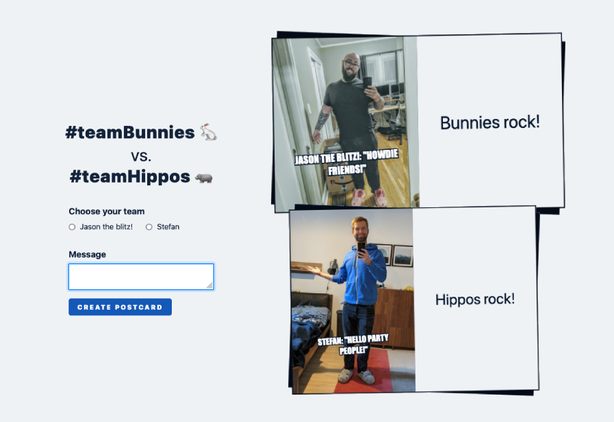

# The Goofy Postcard



[The Goofy Postcard](https://goofy-postcard.netlify.app/) shows how to use [the Contentful GraphQL API](https://www.contentful.com/developers/docs/references/graphql/) and [Netlify On-demand builders](https://docs.netlify.com/configure-builds/on-demand-builders/).

This code of this repository was created in the webinar ["Stop playing cache-up: How to render content on the fly for faster builds with Jamstack"](https://www.contentful.com/resources/render-content-on-the-fly-with-jamstack/)

## Site & project structure

The built site provides two routes:

1. `/` to display a formular that allows you to pick a character and define a message
1. `/postcard/:id/message/:msg` to render and cache a virtual postcard on demand

### `/` - a static HTML file with a sprinkle of JavaScript

The index route is [a static HTML file](https://github.com/stefanjudis/goofy-postcard/blob/main/index.html) that fetches Contentful data client side to show postcard options. It leverages [good old `fetch`](https://developer.mozilla.org/en-US/docs/Web/API/Fetch_API) to make the HTTP request.

### `/postcard/:id/message/:msg` - a redirected serverless function

[The function endpoint](https://github.com/stefanjudis/goofy-postcard/blob/main/netlify/functions/postcard.js) leverages Netlify redirects to map URL query parameters to URL paths.

```
/generated/postcard type=:type message=:message /postcard/:type/message/:message 301!
/postcard/:type/message/:message /.netlify/builders/postcard 200
```

To make HTTP requests the function uses [cross-fetch](https://www.npmjs.com/package/cross-fetch) and accesses the needed Contentful credentials via environment variables defined at Netlify.

The virtual postcards are rendered and cached using the `@netlify/functions` package, which is part of [On-demand Builders](https://docs.netlify.com/configure-builds/on-demand-builders/).
