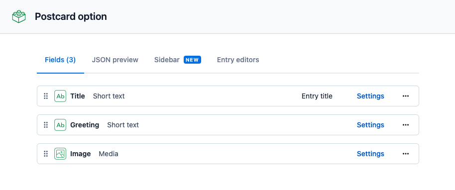

# goofy-postcard

## Steps to follow

### Content model setup (Stefan)



### Create entries (Stefan)

@stefan Have the pictures at hand. :)

### Create `index.html` and show `netlify dev` ask Jason about it (Stefan)

```html
<!DOCTYPE html>
<html lang="en">
  <head>
    <meta charset="UTF-8" />
    <meta http-equiv="X-UA-Compatible" content="IE=edge" />
    <meta name="viewport" content="width=device-width, initial-scale=1.0" />
    <title>Document</title>
  </head>

  <body>
    <h1>Hello world</h1>
  </body>
</html>
```

### Edit and adjust `index.html` to fetch Contentful data (Stefan)

```javascript
const CONTENTFUL_SPACE = "tldd7x6v2iqj";
const CONTENTFUL_CDA_TOKEN = "QWsWpZckweHt7DXGe8qBhFLI_MPwnaIZUKLSAAzDj4I";

const query = `
  query {
    postcardOptionCollection {
      items {
        sys {
      id
    }
    title
    greeting
        image {
          title
          url
        }
      }
    }
  }
`;

const response = await window.fetch(
  `https://graphql.contentful.com/content/v1/spaces/${CONTENTFUL_SPACE}`,
  {
    method: "POST",
    headers: {
      "content-type": "application/json",
      Authorization: `Bearer ${CONTENTFUL_CDA_TOKEN}`,
    },
    body: JSON.stringify({ query }),
  }
);

const { data } = await response.json();
const { items } = data.postcardOptionCollection;
console.log(items);
```

#### Render form items (Stefan)

```javascript
function renderItems(items) {
  document.body.innerHTML = `
    <h1>#teamBunnies vs. #teamHippos</h1>
    <form method="get" action="/">
      ${items
        .map(
          (item) => `
          <label for=${item.sys.id}>${item.title}</label>
          <input id=${item.sys.id} value="${item.sys.id}" type="radio" name="type">
        `
        )
        .join("")}
      <label for="message">Message</label>
      <textarea name="message" id="message" required></textarea>

      <button type="submit">Create postcard</button>
      </form >
    `;
}
```

### Handover to Jason for setting up serverless function (Jason)

Install dependencies and set up `package.json`.

```bash
npm init --yes
npm install cross-fetch
```

⚠️ Set up environment variables in Netlify.

```javascript
// netlify/functions/postcard.js
const fetch = require("cross-fetch");
const { CONTENTFUL_SPACE, CONTENTFUL_TOKEN } = process.env;

async function handler(event, _context) {
  const { type, message } = event.queryStringParameters;
  console.log(type, message);
  return {
    statusCode: 200,
  };
}

exports.handler = handler;
```

⚠️ Point form to `/.netlify/functions/postcard` and see log of `type` and `message`.

Add Contentful fetching and rendering.

```javascript
const fetch = require("cross-fetch");
const { CONTENTFUL_SPACE, CONTENTFUL_TOKEN } = process.env;

async function handler(event, _context) {
  const { type: typeId, message } = event.queryStringParameters;

  const query = `
    query($typeId: String!) {
      postcardOption(id: $typeId) {
        title
        greeting
        image {
          title
          url
          width
          height
        }
      }
    }
  `;

  const response = await fetch(
    `https://graphql.contentful.com/content/v1/spaces/${CONTENTFUL_SPACE}`,
    {
      method: "POST",
      headers: {
        "content-type": "application/json",
        Authorization: `Bearer ${CONTENTFUL_TOKEN}`,
      },
      body: JSON.stringify({
        query,
        variables: {
          typeId,
        },
      }),
    }
  );

  const { data: entry } = await response.json();
  const { greeting, title, image } = entry.postcardOption;

  return {
    statusCode: 200,

    body: `
      <!DOCTYPE html>
      <html lang="en">
      <head>
        <meta charset="UTF-8">
        <meta http-equiv="X-UA-Compatible" content="IE=edge">
        <meta name="viewport" content="width=device-width, initial-scale=1.0">
        <title>Here's a post card for you!</title>
      </head>
      <body>
        
        <p>${title} "${greeting}"</p>
        <div>${decodeURIComponent(message.replace(/\+/g, " "))}</div>
      </body>
      </html>
    `,
  };
}

exports.handler = handler;
```

### Moving to on-demand handlers - set up redirects (Jason)

Discuss the query param topic...

Set up `_redirects`. \*\*Note that we're still pointing to `/.netlify/functions/postcard`.

```
/generated/postcard type=:type message=:message /postcard/:type/message/:message 301!
/postcard/:type/message/:message /.netlify/functions/postcard 200
```

And change the form to point to `/generated/postcard`.

### Make serverless function on-demand (Jason)

Install function plugin.

```bash
npm install @netlify/functions
```

Make function on-demand.

```javascript
const { builder } = require("@netlify/functions");

// ... all the stuff

exports.handler = builder(handler);
```

Update `_redirects` to points to `generated`.

```
/generated/postcard type=:type message=:message /postcard/:type/message/:message 301!
/postcard/:type/message/:message /.netlify/generated/postcard 200
```

Change to URL parsing instead of queryParam parsing.

```javascript
async function handler(event, _context) {
  const parsedUrl = /\/postcard\/(?<type>.*?)\/message\/(?<message>.*?)$/.exec(
    event.path
  );

  const { groups } = parsedUrl;
  const { message, type: typeId } = groups;

  // more stuff ...
}
```

### Wrap up! We made it!

Good job! We dit it. 🎉
